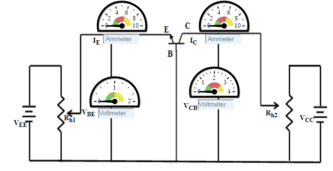

### Procedure

### BJT Common Base - Input Characteristics
1. Initially set rheostat Rh1 = 1 &#937; and rheostat Rh2 = 1 &#937; 
2. Set the Collector-Base Voltage(VCB) to 1 V  by adjusting the rheostat  Rh2
3. Base Emitter Voltage(VBE) is varied  by adjusting the rheostat  Rh1.
4. Note the reading of emitter current(IE)in m Ampere.
5. Click on 'Plot' to plot the I-V characteristics of Common-Base configuration. A graph is drawn with VBE along X-axis and IE along Y-axis.
6. Click on 'Clear' button to take another sets of readings 
7. Now set the Collector-Emitter Voltage(VCB) to 2 V, 3 V, 4 V
                                    

Figure:1

### BJT Common Base - Output Characteristics
1. Initially set rheostat Rh1 = 1 &#937; and rheostat Rh2 = 1 &#937; 
2. Set the Emitter current(IE)1 mA by adjusting the rheostat Rh1 
3. Vary the  Collector-Base Voltage(VCB)is varied  by adjusting the rheostat Rh2.
4. Note the reading of Collector current(IC).
5. Click on 'Plot' to plot the I-V characteristics of Common-Base configuration. A graph is drawn with VCBalong X-axis and IC along Y-axis.
6. Click on 'Clear' button to take another sets of readings
7. Now set the Emitter Current(IE) to 2 mA

Figure: 2

